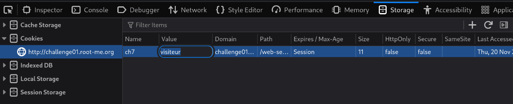

# HTTP - Cookies

## Challenge

Bob created a PHP script to gather user emails
PS: Bob really love cookies!

## Solution

En accédant au site et en cliquant sur le lien "Saved email addresses", on obtient un message nous disant que l'on doit être un admin.

Bob a fait un très bon site et a mit un paramètre "visiteur" dans l'URL

```
http://challenge01.root-me.org/web-serveur/ch7/?c=visiteur
```

En testant de remplacer ce paramètre par `admin`, on obtient un autre message "Problem with cookies"

Dans l'inspecteur de cookies de Firefox, on voit le cookie que l'erreur à l'air de référencer.


En modifiant la value de "visiteur" à "admin" et en rechargeant la page, on obtient le mot de passe en clair. Bob ne fait pas de très bon sites web.

## Flag

ml-SYMPA
