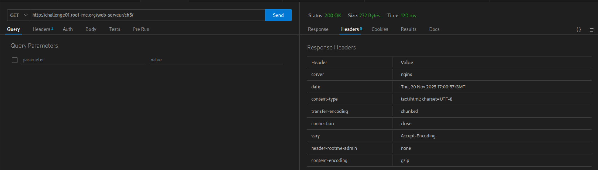
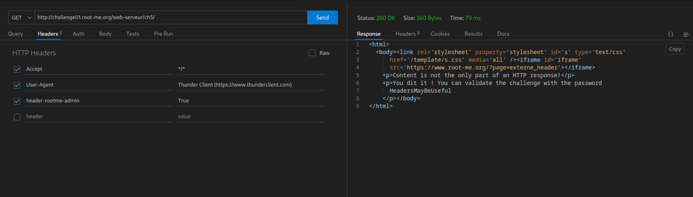

# HTTP - Headers

## Challenge

Get an administrator access to the webpage.

## Solution

On peut inspecter les headers de la page web avec ThunderClient

On observe la présence d'un header `header-rootme-admin` avec une valeur `none`

En testant de refaire une requête avec ce header et diverses valeurs, le mot de passe apparait en clair sur la page

## Flag

HeadersMayBeUseful
